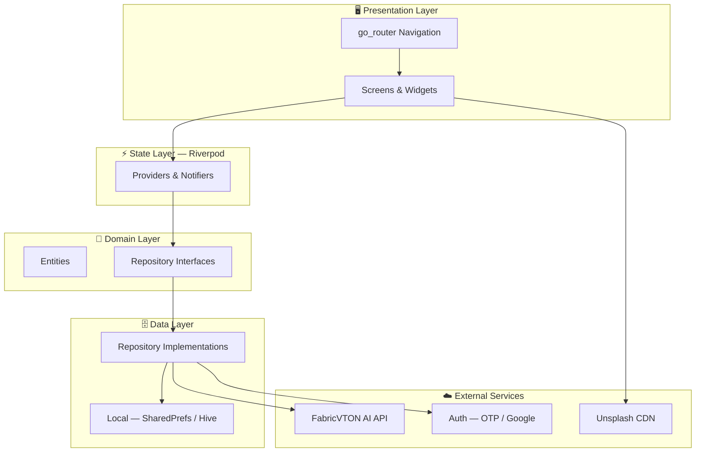

# Clothsy AI

**AI-powered virtual try-on fashion marketplace built with Flutter.**

Browse curated collections, pick any outfit, upload your photo — and see yourself wearing it in photorealistic quality before you buy.

---

## Architecture



### Layer Responsibilities

| Layer | What it does |
|---|---|
| **Presentation** | Screens, widgets, navigation — pure UI, no business logic |
| **State (Riverpod)** | Providers & Notifiers bridge UI ↔ Domain |
| **Domain** | Entities and repository interfaces — framework-independent |
| **Data** | Implements repositories, talks to APIs and local storage |
| **External** | FabricVTON AI, Auth providers, image CDN |

---

## Features

- **AI Virtual Try-On** — Upload a photo and see yourself in any outfit instantly
- **Product Catalog** — Browse by category with filters and search
- **Product Detail** — Size, color, quantity, ratings, and reviews
- **Cart & Checkout** — Full shopping bag and order flow
- **Order History** — Track all past orders
- **Wishlist** — Save favourites across sessions
- **Auth** — Phone OTP + Google Sign-In
- **Onboarding** — 3-slide animated editorial intro

---

## Stack

| | |
|---|---|
| Framework | Flutter (Dart) |
| State | Riverpod |
| Navigation | go_router |
| AI Backend | FabricVTON API |
| Fonts | Google Fonts (Playfair Display, Inter) |

---

## Getting Started

```bash
git clone https://github.com/AasthaSudan/vton_marketplace.git
cd vton_marketplace
flutter pub get
flutter run
```

### Flavors

```bash
flutter run -t lib/main_dev.dart       # Development
flutter run -t lib/main_staging.dart   # Staging
flutter run -t lib/main_prod.dart      # Production
```

---

## Project Structure

```
lib/
├── core/           # Theme, router, constants, API client
├── features/       # Auth, home, catalog, tryon, cart, orders, profile…
├── shared/         # Reusable widgets — buttons, cards, inputs, selectors
└── main_*.dart     # Entry points per flavor
test/               # Widget + unit tests (56/56 passing)
```

---

## Tests

```bash
flutter test
```

---

## License

MIT © 2024 Aastha Sudan
